Tutorial de laboratorio
#######################

Este tutorial le enseñara a utilizar las herramientas para que pueda completar los laboratorios

.. contents:: Contenidos del tutorial
    :depth: 4

Electric
********

Creación de una celda
=====================

A  lo  largo  de  los  laboratorios  se  creará  una  librería  con  diferentes  compuertas lógicas,  que  permitirán  crear  circuitos  más  complejos.  Como  referencia  en  esta  parte del tutorial se creará un inversor, tanto en su vista en esquemático como el layou

Creación de la una librería y nueva celda
-----------------------------------------

Inicie Electric, y seleccione File˖New libary, elija un nombre para la librería, la librería puede contener cuantas usted desea  y  es una buena forma de agrupar distintas celdas

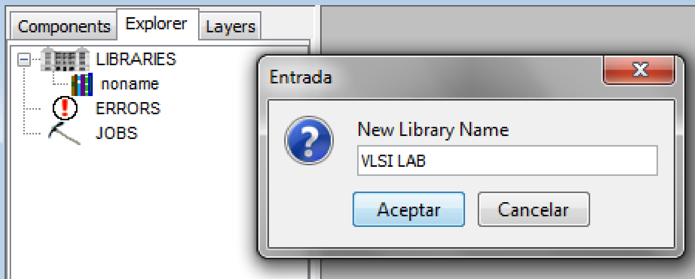

    Nueva librería

Para  crear  una  celda  dentro  de  la  librería  dé    click-derecho  sobre  la  librería  y seleccione  NewCell,  la  celda  puede  tener  múltiples  vistas  por  ejemplo    esquemático, layout  e icono.

La  celda  que  se  construirá  como  ejemplo  será  un  inversor,  se  especificarán  los tamaños  de  los  transistores,  se  incluirán  parámetros  de  Spice  para  la  celda,  y  se utilizarán las herramientas DRC y NCC de Electric, todo esto para que poder tener una idea de cómo debe crear las celdas requeridas en el laboratorio. 

Esquemático
-----------

Para crear la vista en esquemático seleccione la opción en la  siguiente ventana. Seleccione un nombre en este caso Inversor.

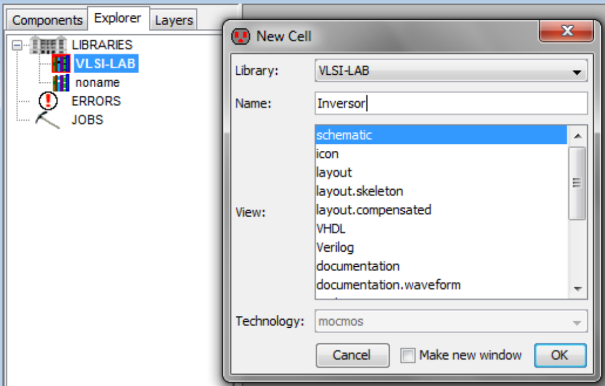

    Nueva celda

Ahora dentro de la librería VLSI lab, usted podrá notar, una  celda Inversor{sch}, dando click sobre esta celda puede iniciar a editarla.

Electric  define  varios  componentes  para  esquemáticos  y  layout,  para  observar los componentes disponibles para la creación de este primer esquemático, de click en la pestaña de componentes y seleccione schematic. Se observara entones la ventana de componentes  tal  como  se  muestra  en  la  :numref:`tuto3`;  esta  lista  de  componentes incluye elementos básicos de un circuito como transistores, resistencias, capacitores.

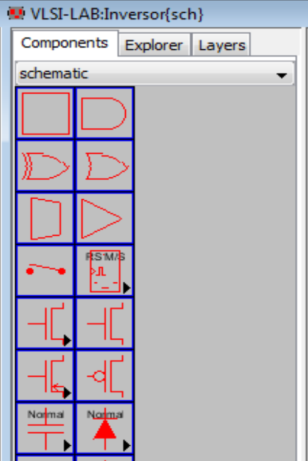
    
    Ventana de componentes de la Librería

El objetivo es dibujar una compuerta como la que se muestra  en la :numref:`tuto4`. Seleccione Window˖Toggle grid para hacer visible grilla, esto le ayudara a alinear los objetos.    Dé  click-izquierdo  sobre  el  símbolo  de  transistor  nMOS,  en  la  ventana  de componentes  (al  lado  izquierdo  de  la  pantalla),  de  click-derecho  sobre  la  ventana  del esquemático para colocar el transistor. Repita lo anterior hasta que tenga, el transistor nMOS,   pMOS,   el   símbolo   de   Tierra   y   de   alimentación   en   la   ventana   de   su esquemático.  Para  mover  los  objetos  basta  con  dar  click-izquierdo  sobre  ellos  y arrastrarlos. El valor de largo/ancho de los transistores por defecto es 2/2, el ancho se puede  cambiar  dando  doble  click  sobre  los  transistores,  para  este  primer  inversor iniciaremos creando el pMOS de un ancho que sea el doble del ancho del nMOS. Los tamaños pueden ser 10𝞴para el pMOS y 5𝞴para el nMOS

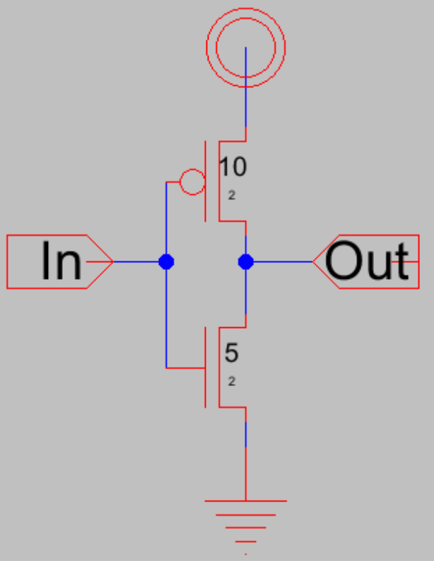

    Esquemático del inversor

Ahora, se deben hacer las conexiones para estos de click-izquierdo sobre alguno de  las  terminales  del  transistor,  ahora  de  click-derecho  sobre  alguna  terminal  del  otro transistor o componente.

Se  necesitan  definir  los  puertos  (entradas,salidas)  de  la  celda.  Para  esto  se  debe seleccionar la entrada e ir a  Export • Create Export. Escoja un  nombre  y seleccione una característica en este caso Input. Se debe hacer lo mismo para la salida.

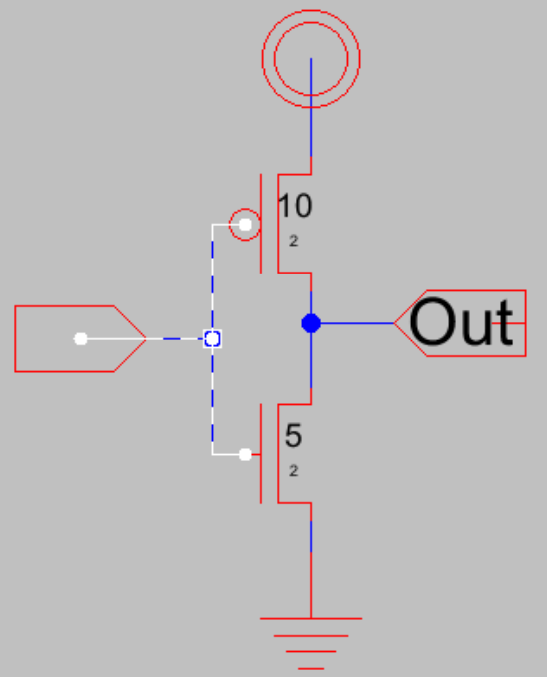

    Seleccionando la entrada

Use  File˖Save  para  salvar  la  librería,  es  bueno  salvar  constantemente  los cambios.

Ícono
-----

Cada  esquemático  tiene  un  símbolo  correspondiente,  llamado icono  usado  para representar la celda en un nivel de jerarquía superior. Se necesita crear un icono para el esquemático que se acaba de crear, para esto seleccionamos view˖MakeIconView.

Electric  creará  un  icono  genérico  y  lo  colocara  en  la  vista  de  esquemático.  Sin embargo  el  esquemático  es  más  fácil  de  leer  cuando  el  icono  usado    nos  resulta familiar,  en  lugar  de    las  cajas  genéricas  que  Electric  crea,  por  lo  que  es  buena  idea modificar este icono para obtener el símbolo representativo de un inversor.

Para editar el icono, damos click sobre él y seleccionamos Cell˖DonwHierarchy, borramos  la  caja  genérica  y  utilizamos  las  distintas  formas  para  crear  un  inversor,  es buena idea mantener la grilla encendida para que la entrada y salida queden alineadas.

Layout
------

Ahora crearemos el layout. Vaya a Cell˖NewCell  y seleccione la vista de layout, utilice el mismo nombre que uso para el esquemático. Al hacer esto la librería se verá como se muestra a continuación, donde  la celda Inversor tiene tres vistas.

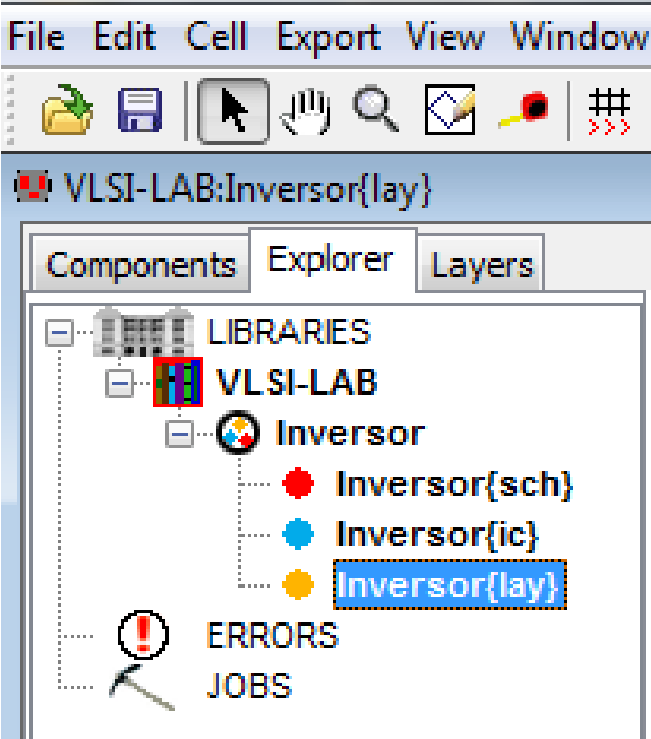

    Celda del inversor

Todas  las  celdas  se  construirán  usando  la  tecnología  mocmos  (tecnología MOSIS CMOS),  vaya a File˖Preferences˖Tecnology,  seleccione mocmos, 3 capas de metal, 2 de poli y opción de submicron rules. También es necesario cambiar la escala a para esto vaya  a File˖ Preferences ˖Scale seleccione 300 nm.

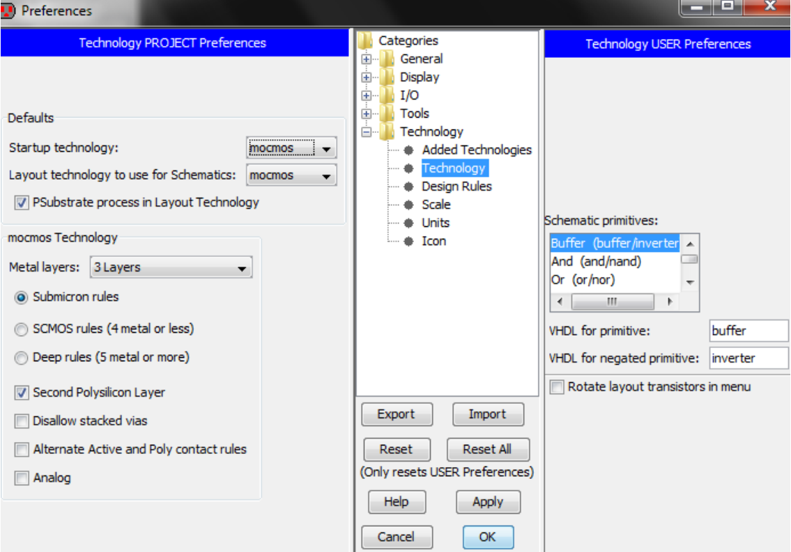

    Tecnología mocmos

Es importante escoger un “estilo” consistente para dibujar las celdas de forma que cuando se necesite construir circuitos más complejos, las celdas de nuestra librería puedan “calzar” unas con otras similar a un LEGO. Para este laboratorio Vcc y Vss deberán correr de forma horizontal en la parte superior e inferior de la celda en  metal 1,  el espacio entre Vcc  y  Vss será de 80 λde centro a centro.  Los transistores nmos ocuparan la parte inferior de la celda y los pmos la parte superior; las entradas y salidas se conectaran por medio de contactos de metal 2, aparte de esto las ningún metal2 o 3 deberá ser utilizado dentro de las celdas. Teniendo esto en cuenta se iniciará a construir el inversor.

Empiece  por  colocar  el  transistor  nmos.  Usted  notara  una  pequeña  cruz  en  la pantalla, este es el centro o origen (0,0), dibuje el su inversor a una buena distancia del centro al terminar el layout  moveremos el inversor a la posición correcta.

En  la  pestaña  de  componentes  se  encuentra  el  transistor  nmos,  colóqueloen  la ventana, recuerde que un transistor nmos se forma cuando poli-silicio cruza sobre una difusión N, en Electric la difusión n es representada como una difusión verde rodeada de  capa  punteada  de  color  amarillo,  y  la  capa  sombreada  de  color  amarillo  que“contiene” el transistor representa el pozo de material P.

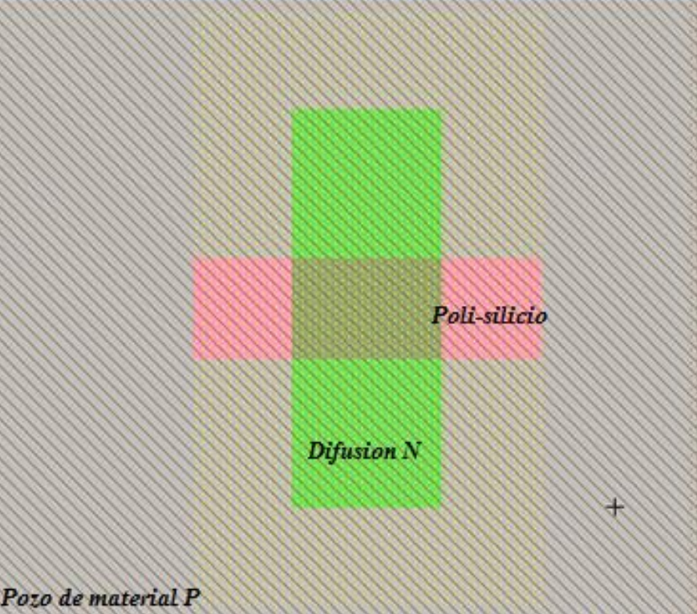

    Trasistor Nmos

Ahora  rotemos  el  transistor  para  que  la  capa  de  poli-silicio  quede  de  forma vertical, esto lo puede hacer en Edit˖Rotate  o  también  haciendo  doble  click  sobre  el transistor,  con  esta  última  opción  también  se  pueden  cambiar  otras  propiedades  del componente incluyendo  el ancho.  Ahora  coloque un transistor Pmos, rótelo 90 grados y cambie su tamaño  a 5𝞴.

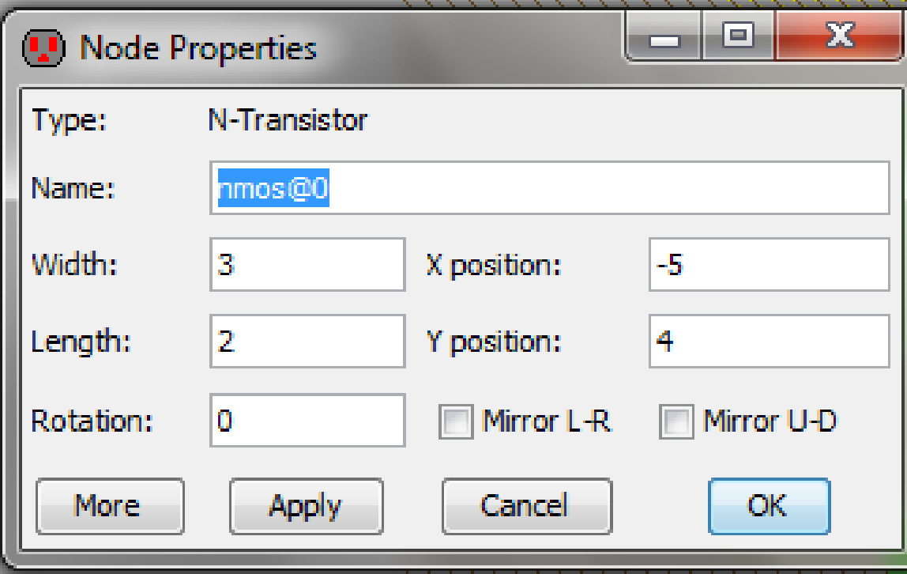

    Propiedades del transistor

Modelos de Spice para los transistores
^^^^^^^^^^^^^^^^^^^^^^^^^^^^^^^^^^^^^^

Para poder tener la posibilidad de simular las compuertas que se crean a lo largo del  laboratorio  la  es    necesario  establecer  el  modelo de  Spice  para  los  transistores, seleccione  el  transistor  Pmos  y  vaya  a  Tools˖Spice˖SetSpiceModel,  al  hacer  esto aparecerá un texto sobre el transistor.

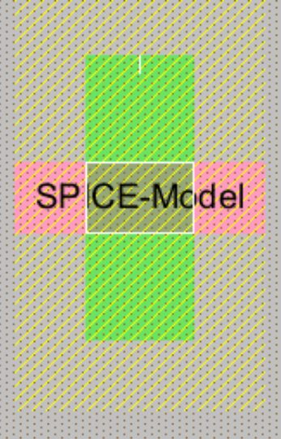

    Estableciendo el modelo de Spice

Debemos cambiar este texto a PMOS para esto nos posicionamos sobre el texto y con Crtl+I lo editamos.

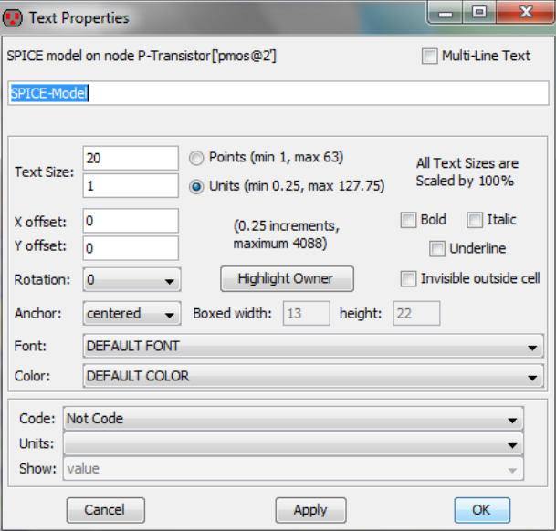

    Cambiando el modelo a PMOS

Hacemos lo mismo con el transistor NMOS, cambiando el modelo a NMOS.

    Modelo de Spice transistor NMOS

Una  vez  que  se  establecieron  los  modelos  de  Spice   es  posible   continuar dibujando el layout para  el inversor. Conecte los  poli-silicio, haciendo click izquierdo en el  extremo  inferior  del  pMOS  y  click  derecho  en  el  extremo  superior  del  nMOS. Para este punto usted deberá tener su diseño como se muestra a continuación.

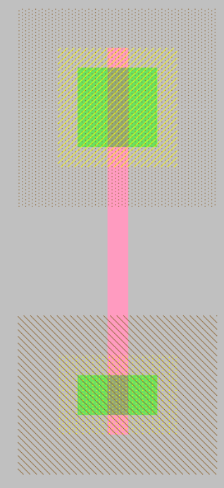
    
    Inversor: conexión PMOSy NMOS

Hay  que  crear    contactos  a  ambos  lados  en  el sourcey drainde  cada  transistor. Para  eso,  seleccionamos    Metal-1-Active-Contact  n  o  p,  según  corresponda.  Para  el transistor n, seleccionamos el nAct,  y lo creamos a alguna distancia a la izquierda del transistor n. Hacemos doble click sobre el contacto y fijamos su valor y en 4 (el mismo que  el  transistor).  Se  ocupan  dos  contactos  ya  uno  está  hecho,  para  duplicarlo seleccionamos  el  objeto  y  presionamos  CTRL-M,  colocamos  este  otro  contacto  a  la derecha del transistor nMOS.

Antes de acercarlo  al drain y source debemos  realizar las conexiones, hacemos click  izquierdo  sobre  el  contacto    y  luego  hacemos  click  derecho  sobre  el draino source.

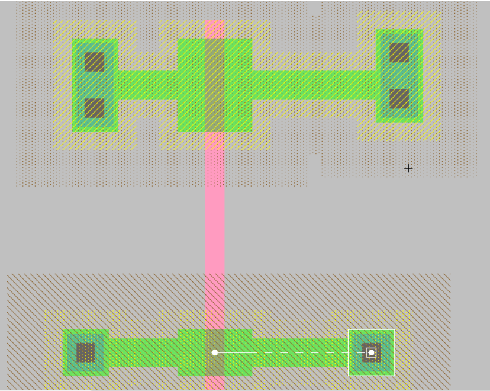

    Inversor: contactos

DRC
^^^

Antes de acercar los contactos a la difusión utilizaremos la herramienta DRC de Electric  que  indica  las  violaciones  de  reglas  en  nuestro  layout.  Seleccionamos  en  el menú: Tools, DRC, Check Hierarchically,  o solo presionamos F5. 

No  debería haber  errores.  Si  los  hubiera,  presionando  >  o  <  se  puede  ver  todos los errores .El error aparecerá en la ventana de mensajes y se señalará en la ventana del layout  tal  y  como  se  muestra  a  continuación.  También  se  pueden  observar  los  errores en la pestaña Explorer.

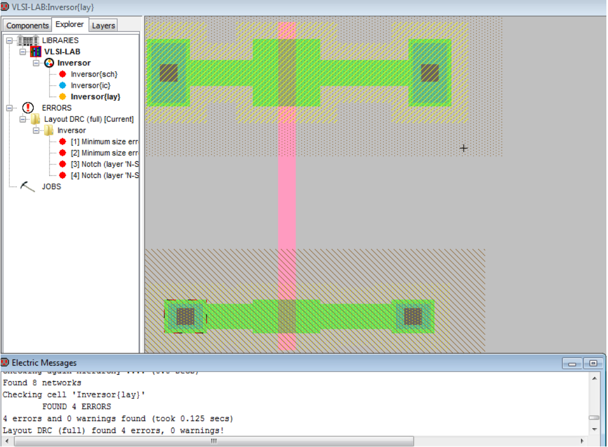

    DRC

Hay que acercar los contactos al transistor tanto como sea posible, sin violar las reglas de diseño que en este caso son 3𝞴. Para eso es más fácil mostrar el cuadriculado, el cual está en distancias de lambda, en el menú: Window, Toggle Grid. 

Ahora  agreguemos  Vcc  y  tierra.  Las  líneas  deben  ser  de  un  ancho  de  8 λ,  para agregar  la  línea  seleccione  metal-1-pin,  dibujar  la  líneaen  el  lado  derecho  usando primer el click izquierdo y luego el click derecho, dando doble click en la línea cambie el  ancho  a  8 λ,  ahora  colocaremos  estas  líneas  a  una  distancia  de  80 λ,  para  realizar mediciones vamos a Window˖Measurements˖ ToggleMeasumentMode. 

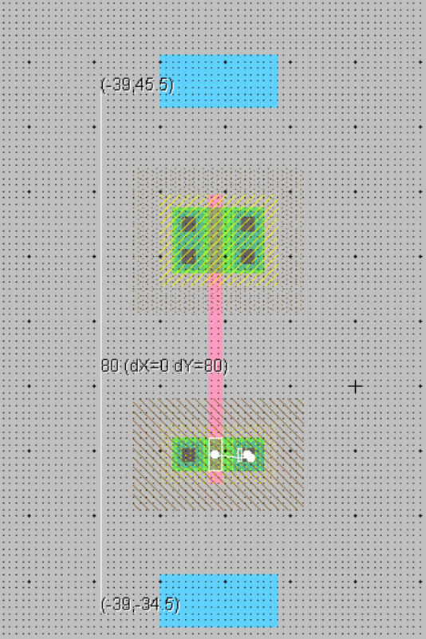
    
    Inversor: líneasde Vcc y Vss

Ahora  acerque  los  transistores  a  una  distancia  de  1  lamda  de  la  líneas  de  metal que  acabamos  de  crear,  de  mantenga  el  click  izquierdo  presionado  para arrastrar  el transistor.

Para  realizar  la  conexión  entre  el  metal  1  y  los  contactos,    haga  click  izquierdo sobre el contacto y click derecho sobre el metal 1, si el ancho de esta conexión resulta ser  de  8𝞴,  de  doble  click  sobre  el  cable  para  cambiar  las  propiedades  y  ajustar  el ancho a 4 𝞴

Cuando haya terminado de realizar estas conexiones, debe extender las líneas de  Vcc  y  Vss,  2𝞴más  allá  del  contenido  de  la  celda.  Esto  para  que  al  conectar  distintas celdas  su  contenido  estén  separados  por  una  distancia  de  4 λy  se  cumpla  así  con  las reglas de diseño.

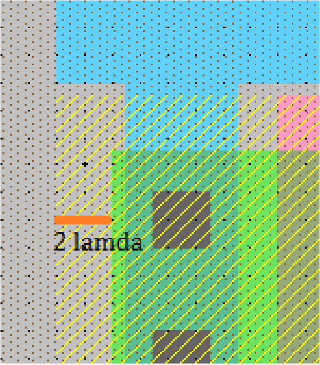

    Inversor: Vss y Vcc

Su layout debe verse similar a la figura que se muestra a continuación, recuerde utilizar  contantemente  la  herramienta DRC,  para  verificar  que  la  celda  cumpla  las reglas de diseño.

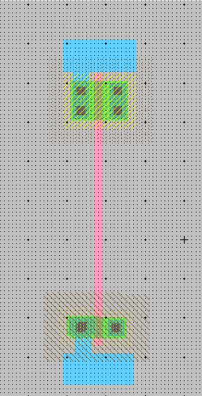

    Inversor

Recuerde  que  es  necesario  colocar  contactos  en  los  pozos  para  evitar  que  los diodos BJT que se forman entre  pozo   y source/drain se polaricen. Pondremos Nwell taps  and  P-well  taps  en  cada  celda  sobre  los  cables  de  Vcc  y  Vss  cada,  estos  se encuentran en la ventana de componentes. 

Colocamos los taps de vdd seleccionando Metal-1-P-Well-Con para el pozo P  y colocándolo “encima” del metal del GN. Se colocan al menos 2 taps, al menos a 3 lambdas  de  distancia  entre  ellos.  Luego  de  conectar  cada  uno  hay  que  conectarlo  al metal por medio de la combinación click-izquierdo-click-derecho. Se realiza lo mismo  con Vdd, usando Metal-1-N-Well-Con.Su  compuerta  debe  lucir  como  se  muestra  en la siguiente figura.

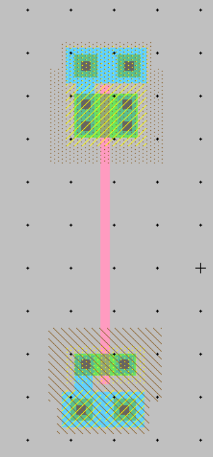

    Inversor: taps

Ahora   conectaremos      la   entrada   al   poli-silicio,   usando   el   ícono   Metal-1-Polisilicon-1-Contact.  Lo  colocamos  unos  cuantos  lambdas  a  la  izquierda  del  poli-silicio y lo conectamos con el click derecho, también debemos realizar la conexión de metal 1 para la salida del inversor y colocar un contacto de metal 1 metal2 (vía). 

Solo falta exportar la entrada, salida, Vcc y Vss y su compuerta debe lucir como se muestra en la figura a continuación 

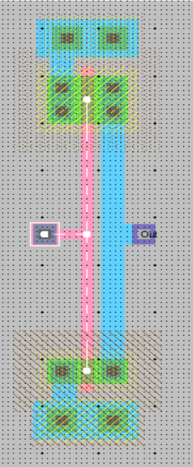

    Inversor contactos de entrada y salida

Para exportar la entrada seleccionamos  el contacto, y en Export˖CreateExport se le  debe  dar  un  nombre,  se  hace  lo  mismo  con  la  salida.  Para  Vcc   y  Vss  el procedimiento  es  similar  solo  que  en  este  caso  en  característica  se  debe  seleccionar power   o   gnd   según   corresponda,   Electric   reconoce   vdd   y   gnd   como   nombres especiales, asegúrese por lo tanto de usar esos nombres.

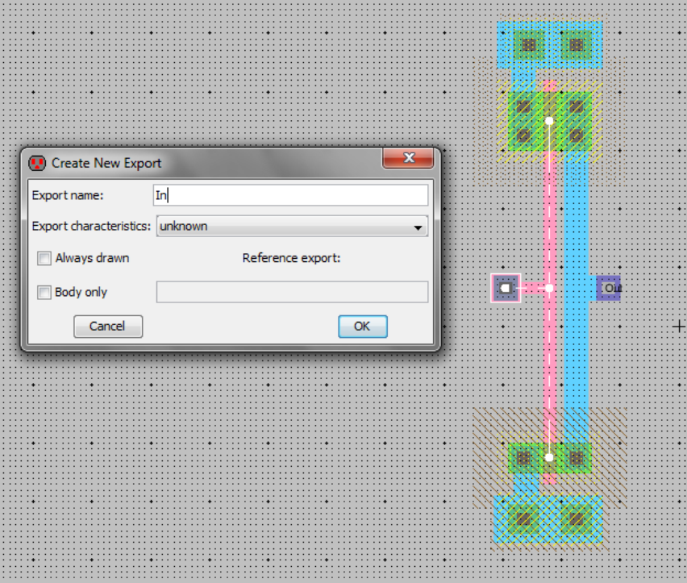

    Inversor: exportando la entrada

Al terminar la compuerta verifique nuevamente que  la compuerta cumpla con las reglas de diseño.

La  última  tarea  consiste  en  posicionar  la  celda  en  lugar  correcta,  centrarla facilitara  conexiones  en  otros  circuitos.  Para  esto  utilizamos  el  botón Toggle-special-select selecionanos el  centro  de  la  ventana  y  arrastramos  el  símbolo  de  cruz  al centro de nuestra celda.

NCC
^^^

Electric puede comparar dos celdas diferentes para determinar si tienen la misma topología.  Esta  operación  se  llama  Layout  vrs  Squematic,  es  un  tipo  de  verificación formal,  pero  Electric  puede  comparar  dos  circuitos,  sin  importar  que  ambos  sean esquemáticos   o   layout   por   eso   en   Electric   se   usa   el   término   NCC   (Network Consistency Checking). 

Vaya a File˖Preferences˖Tools˖NCC y asegúrese que las opciones marcadas sean iguales a las siguientes

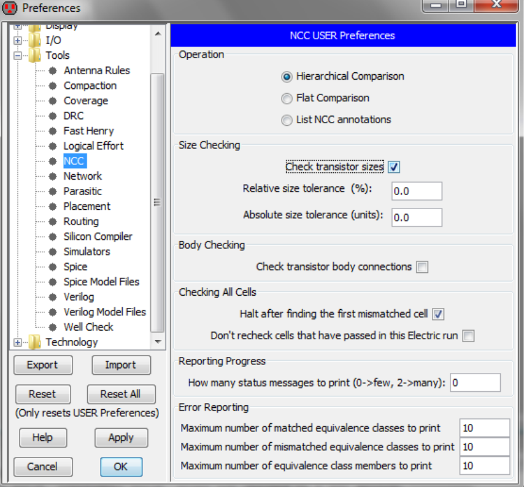

    Preferencias para NCC

Ahora   corrobore   que   su   esquemático   y   layout   sean   equivalentes,   vaya   a Tools˖NCC˖SchematicandLayoutViews... Si no hay ninguna diferencia en la ventana de mensajes de Electric deberá observar el siguiente mensaje.

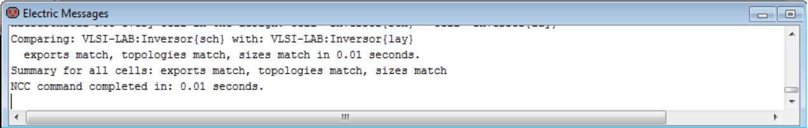

    LVS

Si existiera alguna diferencia, entonces observara una ventana como la siguiente, corrija su celda si es necesario.

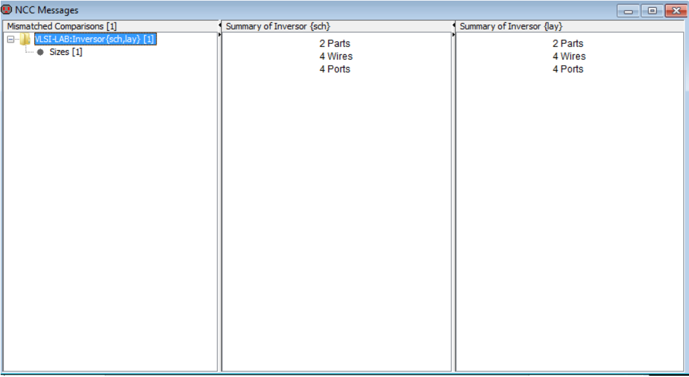

    Mensajes de la herramienta NCC

Si desea  conocer  los  detalles  se  debe  hacer  click  sobre  las  diferencias  del  lado izquierdo de la ventana de mensajes del NCC

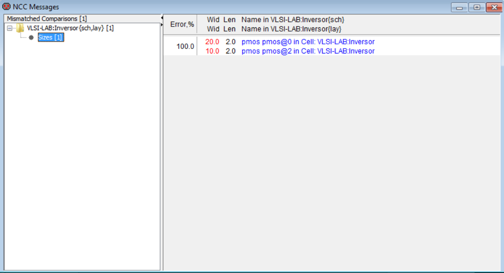

    Diferencia reportadas por NCC

Preparar la simulación en Spice
-------------------------------

Electric puede generar archivos de entrada para diferentes simuladores externos, en  nuestro  caso  usaremos  LTspice.  Pero  antes  de  realizar  una  simulación  se  deben cambiar algunas de las preferencias que Electric tiene por defecto.

En File˖Preferences, en la sección “Tools” seleccionamos Spice, y cambiamos las preferencias a las que se muestran a continuación.

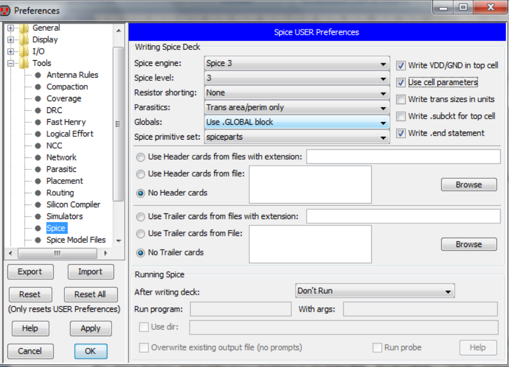

    File/Preferences/Tools/Spice

Verifique  los  transistores  de  la  celda  que  desea  simular  tengan  definido  el modelo de Spice, ya sea NMOS o PMOS para hacer esto seleccione el transistor y vaya a Tools˖Spice˖SetSpiceModel, al hacer esto aparecerá un texto sobre el transistor que deberá cambiar a PMOS o NMOS.

Siempre  que  se  vaya  a  hacer  una  simulación  copiaremos  la  celda  que  deseamos simular  y  cambiaremos  su  nombre,  debe  ser  un  nombre  representativo  por  ejemplo Inversor_lay_sim. Como ejemplo realizaremos la simulación para un inversor.

Primero creamos una nueva celda en vista de layout o esquemático según lo que se  desee  simular,  vamos  a  Cell˖PlaceCellInstanse  y  seleccionamos  la  celda  que deseamos simular en este caso Inversor {lay}

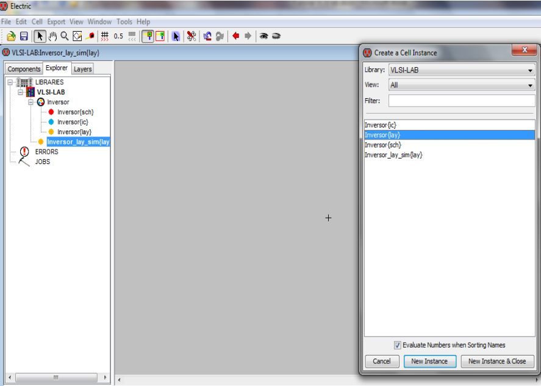

    Nueva versión de la celda para simulación

Usted deberá tener algo similar a lo que se muestra a continuación.

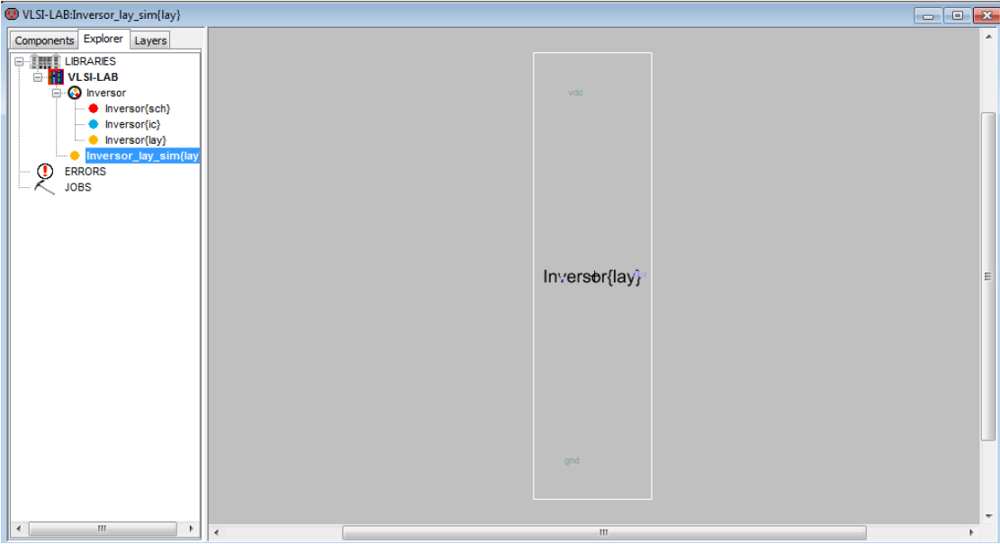

    Nueva celda para simulación

Si  observa  con  atención  podrá  notar  que  los  puertos  que  se  exportaron  están  se pueden  ver  en  esta  celda  vamos  a  conectar  estos  puertos  y  darles  un  nombre  para  la simulación en Spice. Para conectarlos basta con hacer click sobre los puertos y dar otro clicken otro lugar de la ventana. Ahora para cambiar el nombre solo es necesario hacer doble click sobre las líneas de metal y cambiar el nombre de la “net”.

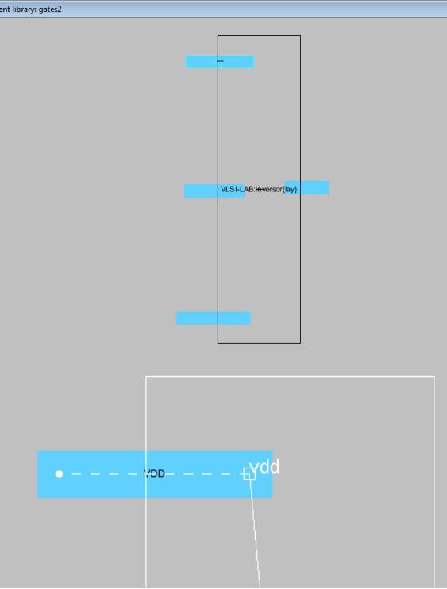

    Conexiones y nombres para la simulación

Ahora se debe  incorporar el código de Spice que se desea simular, en las pestaña de componentes seleccionamos MISC ˖SpiceCode. De Click sobre la ventana para colocar el texto, y ahora presione Crtl+I para modificarlo.

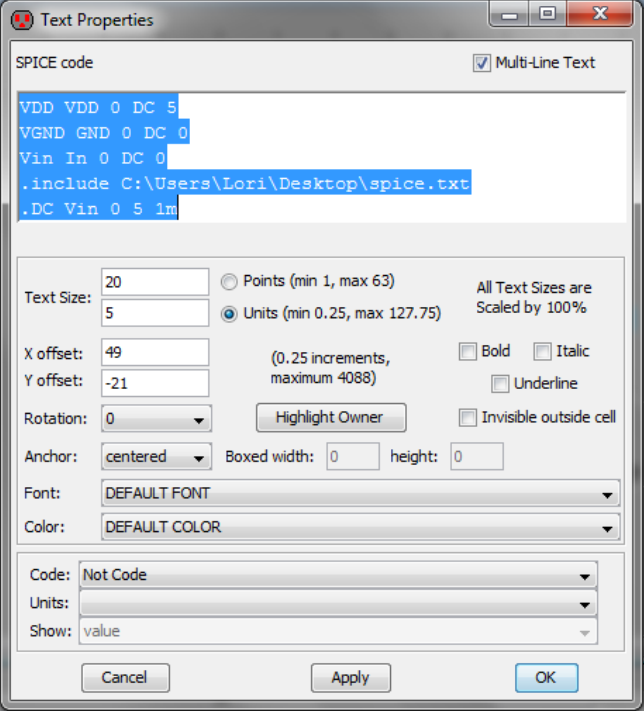

    Ventana donde se incorpora el códido de Spice

De click en Ok y ahora pondrá ver este código en la ventana donde esta su celda para  simulación,  modifique  el  tamaño  del  texto  para  que  sea  visible  y  de  click  en  la opción  de  multilinea. Como  ejemplo  para  esta  simulación  cambiaremos  el  voltaje  de entrada  de  0  a  5  volts,  y  no  pondremos  ninguna  carga  la  salida  de  la  compuerta. Debemos  crear  el  archivo spice.txt que  rd el  archivo  que  contiene  los  parámetros  para simulación  de  Spice,  estos  parámetros  son  para  un  proceso  subsidiado  por  MOSIS, asegúrese  de  incluir este  archivo  de  forma  correcta  y  de  que  los  nombres  de  las conexiones que realizó correspondan a los nombres del código de Spice. Ejemplo de archivo a incluir:

.. code-block:: 

    *** 0.5um CMOS technology 
    ***
    *SPICE LEVEL3 PARAMETERS
    .MODEL NMOS NMOS LEVEL=3 PHI=0.7 TOX=9.5E-09 XJ=0.2U TPG=1
    + VTO=0.7 DELTA=8.8E-01 LD=5E-08 KP=1.56E-04
    + UO=420 THETA=2.3E-01 RSH=2.0E+00 GAMMA=0.62
    + NSUB=1.40E+17 NFS=7.20E+11 VMAX=1.8E+05 ETA=2.125E-02
    + KAPPA=1E-01 CGDO=3.0E-10 CGSO=3.0E-10
    + CGBO=4.5E-10 CJ=5.50E-04 MJ=0.6 CJSW=3E-10
    + MJSW=0.35 PB=1.1

    *SPICE LEVEL3 PARAMETERS
    .MODEL PMOS PMOS LEVEL=3 PHI=0.7 TOX=9.5E-09 XJ=0.2U TPG=-1
    + VTO=-0.95 DELTA=2.5E-01 LD=7E-08 KP=4.8E-05
    + UO=130 THETA=2.0E-01 RSH=2.5E+00 GAMMA=0.52
    + NSUB=1.0E+17 NFS=6.50E+11 VMAX=3.0E+05 ETA=2.5E-02
    + KAPPA=8.0E+00 CGDO=3.5E-10 CGSO=3.5E-10
    + CGBO=4.5E-10 CJ=9.50E-04 MJ=0.5 CJSW=2E-10
    + MJSW=0.25 PB=1

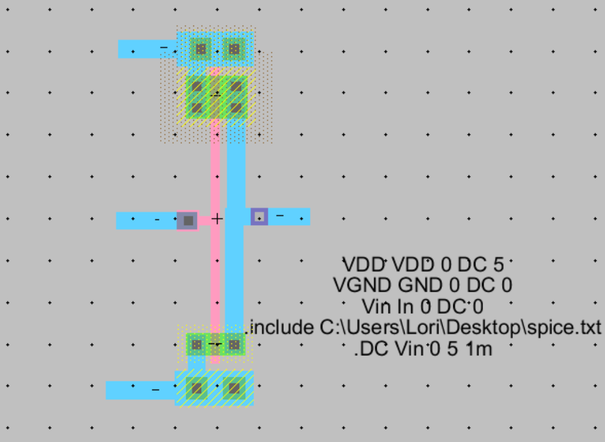

    Celda lista para la simulación

Para  este  punto  tal  vez  no  comprenda  este  código  de  Spice,  por  lo  que  en  la siguiente sección Código de Spice  se detalla las opciones que se pueden  utilizar para otro tipo de simulaciones.

Ahora   generaremos  el   código  para  Spice  ,vaya  a  Tools/Simulation(Spice)/ WriteSpiceDeck. Con estose creara un archivo de extensión .spi que es la entrada para la simulación en LTspice.

LTSPICE
*******

La  herramienta  para  simulación  es  un  simulador  de  SPICE  de  código  abierto,  y es compatible con Electric,  de forma que los archivos de Spice generados por Electric funcionan perfectamente en la herramienta de simulación

Simular en LTSPICE
==================

Abrá LTSpice y vaya File˖Open y busque el archivo que desea simular.

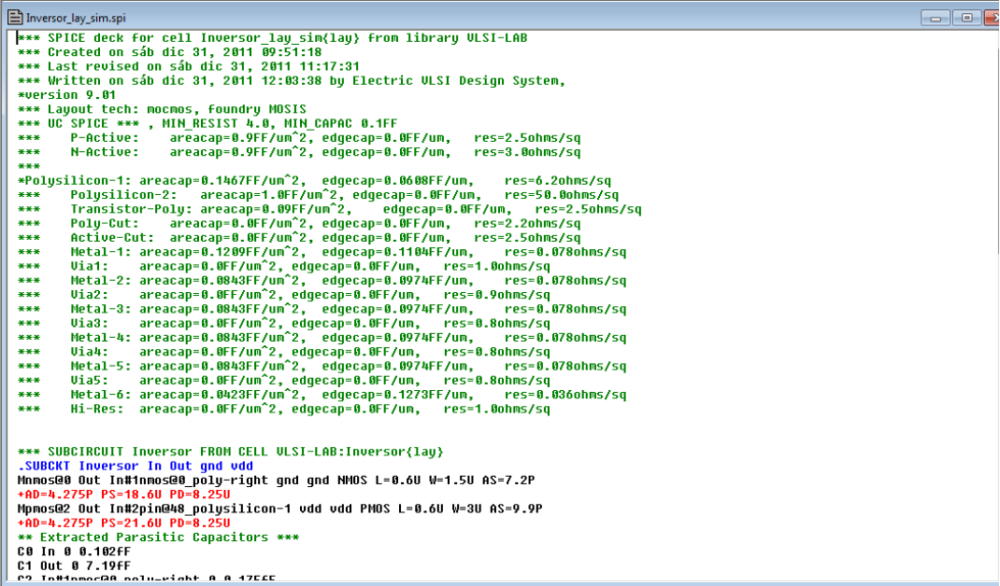

    Archivo .spi en LTspice

Para  correr  la  simulación  de  click  en  el  botón |run_ico|. Si el botón de correr no funciona intente cambiar la extensión del archivo .spi o .cir. Ahora  tendrá  una  nueva ventana  en esta es donde se  grafican los resultados de la simulación, vaya a |wave_ico| para seleccionar las señales que desea graficar.

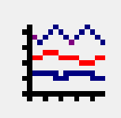

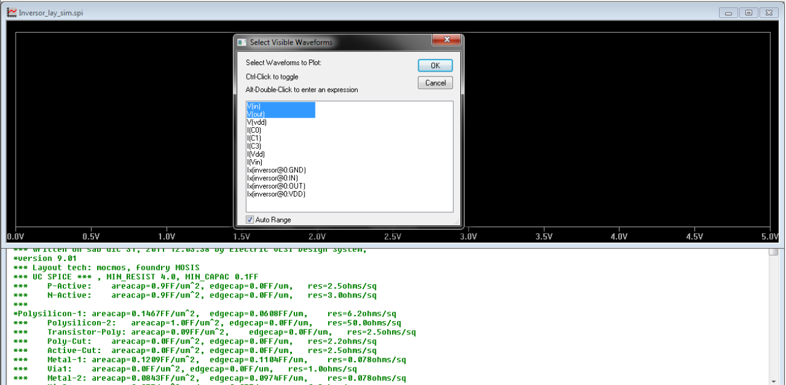

    Selección de las señales

El grafico  para el inversor construido en la etapa anterior debería verse como  el siguiente

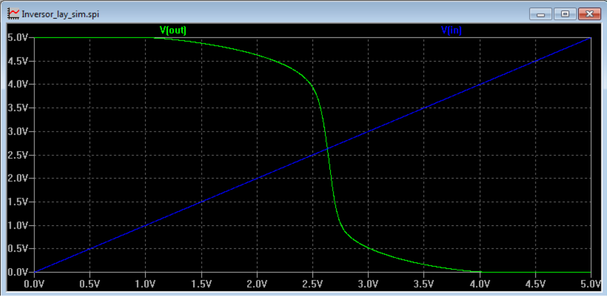

    Curva característica del inversor

También se puede graficar en distintas ventanas, por medio de la opción “Add Plot Pane”

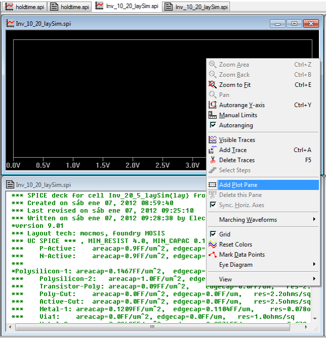

    Como agregar ventanas para graficar

Se pueden agregar tantas ventanas como se desee en este caso se agregó una más para visualizar el voltaje de entrada y el de salida en distintas ventanas

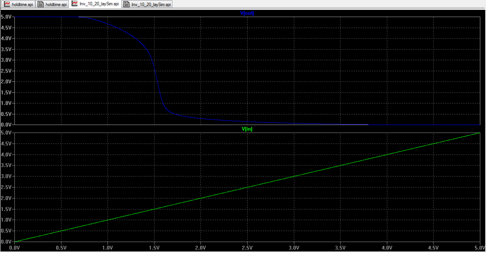

    Dos ventanas de gráficos

Para visualizar un punto con mayor detalle se pueden usar las opciones de zoom 

    Opciones de zoom

Y en la parte inferior izquierda de la pantalla se puede observar las coordenadas del punto.

Código de Spice
===============

Fuente de voltaje
-----------------

Spice tiene varias  fuentes de voltaje: SINE, PULSE,AC, DC. A continuación se muestra un ejemplo para cada una de ellas.

.. code-block::

    DC( {v1} {v2}{distancia entre puntos})
    DC Vin 0 5 1m

    PULSE( {v1} {v2} {tdelay} {𝑡𝑟} {𝑡𝑓} {tiempo en bajo} {periodo} )

    Vin In GND DC 0 Pulse 0 5 1n 1n 1n 10n 20n

    SIN({voffset} {amplitud} {freq} {tdelay})
    Vin In GND DC 0 Sin 4 1 10000kHz

Componentes
-----------

En  Spice  se  pueden  colocar  muchos  componentes  por  ejemplo  resistencias, capacitores, inductores , diodos, líneas de transmisión  y muchos otros.

Capacitor

.. code-block::

    C{nombre} {+nodo} {-nodo} [{modelo}] {valor} 
    CLOAD  Out  0  20pF

Resistencia

.. code-block::

    R{nombre}  {+nodo} {-nodo} [{modelo}] {valor}
    RLOAD  Out  0  2k 

Notas teóricas
**************

Pendiente de las señales
========================

Los cambios de estado  en una señal digital no son instantáneos, la transición de un uno lógico a un cero lógico o viceversa toma cierta cantidad de tiempo de forma que se la transición tiene una pendiente o “slope”.

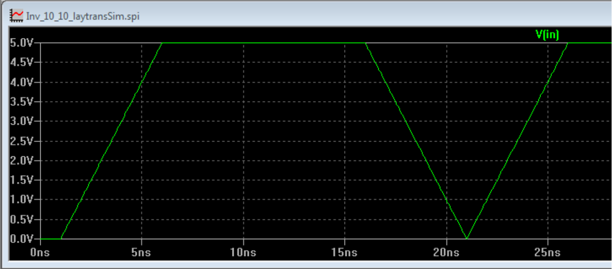

    Pendiente

Para referirnos a la pendiente que se muestra en la figura anterior, se dice que la pendiente es de un 100% en 5 ns